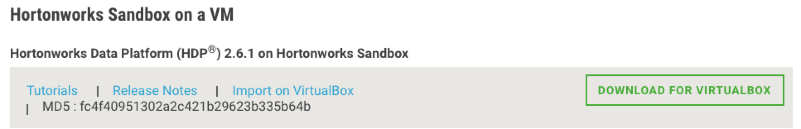

# Hortonworks Sandbox Setup

These demos were last tested with the VirtualBox edition of the 
[Hortonworks Sandbox](http://hortonworks.com/products/hortonworks-sandbox/ "Hortonworks Sandbox") for HDP 2.6.1 as shown in the following screenshot.



Demos were tested with setting VirtualBox RAM to 10240 MB (up from 8192 MB).

NOTE: If seeing "issues" with subsequent restarts of the VirtualBox Sandbox, then see if 
[this HCC answer](https://community.hortonworks.com/questions/139184/sandbox-26-unable-to-start-failed-to-start-crash-r.html?childToView=139428#answer-139428) resolves your concerns.

NOTE: If a more recent version is present you will likely need to naviagate to the "Hortonworks Sandbox Archive" section to find this version. 


## Setup Passwords

After visiting the <http://127.0.0.1:8888> _splash screen_, you will need click on the _Quick Links_ button under the _Advanced HDP_ section to get to the _Advanced HDP Quick Links_ page which presents instructions to enable the `admin` user to log into the Ambari console at 
<http://127.0.0.1:8080>.  Below is an output of what that activity should 
look like.  NOTE: The initial `root` password is `hadoop`, but you are 
required to change it. I suggest setting it to `Hortonworks`.

```
HW10653-2:~ lmartin$ ssh root@127.0.0.1 -p 2222
root@127.0.0.1's password: 
You are required to change your password immediately (root enforced)
Last login: Tue Mar  1 21:05:47 2016 from 10.0.2.2
Changing password for root.
(current) UNIX password: 
New password: 
Retype new password: 
[root@sandbox ~]# ambari-admin-password-reset
Please set the password for admin: 
Please retype the password for admin: 
The admin password has been set.
Restarting ambari-server to make the password change effective...
Using python  /usr/bin/python
Restarting ambari-server
Waiting for server stop...
Ambari Server stopped
Ambari Server running with administrator privileges.
Organizing resource files at /var/lib/ambari-server/resources...
Ambari database consistency check started...
Server PID at: /var/run/ambari-server/ambari-server.pid
Server out at: /var/log/ambari-server/ambari-server.out
Server log at: /var/log/ambari-server/ambari-server.log
Waiting for server start...................................
Server started listening on 8080
DB configs consistency check: no errors and warnings were found.
```

It is suggested that you set the `admin` Ambari user's password
to `admin` for consistency with the other web UIs.