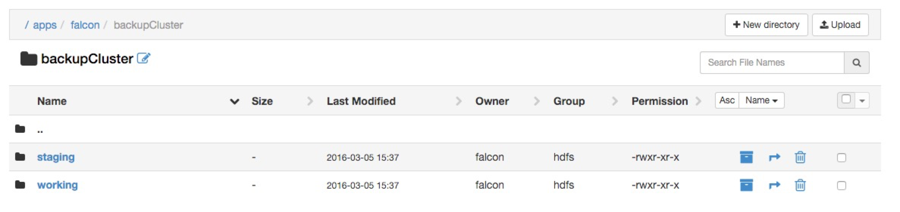

# Data Pipelining with Falcon

**GOAL** - Use Falcon to mirror directories from a source to a target cluster 
via Ranger

**PREREQUISITE** - [Ingesting Data into HDFS](../ingestion/README.md)

**SEE ALSO** - This demo is based on these two publicly-available 
Hortonworks tutorials:

* [Mirroring Datasets between Hadoop clusters with Apache Falcon](http://hortonworks.com/hadoop-tutorial/mirroring-datasets-between-hadoop-clusters-with-apache-falcon/ "Mirroring Data with Falcon") 
* [Define and Process Data Pipelines in Hadoop with Apache Falcon](http://hortonworks.com/hadoop-tutorial/defining-processing-data-end-end-data-pipeline-apache-falcon/ "Data Pipeling with Falcon") 

**RECORDED DEMO**

<a href="http://www.youtube.com/watch?feature=player_embedded&v=Bp96x70HpEM" target="_blank"></a>


## NOTES NOTES NOTES

prereq: ingestion 

ensure Oozie and Falcon are are started from Ambari

create folders for fake source/target hadoop clusters (as admin in ambari)
as well as staging and working subdirectories

/app/falcon  (admin/hdfs)


## Admin Setup

As Ranger is an administrative tool, there are some initial activities that
need to be completed in order to establish the source and target Hadoop 
clusters.  NOTE: In this demo we will actually use the same (Sandbox) cluster
and simply have different directories _simulating_ different clusters.

### Directory Creations

As described in [Securing Hive with Ranger](../ranger/README.md)'s "Allow
Marketing to use Ambari" section, log into Ambari as `admin` and use the
_Create Local User_ functionality to build a `falcon` user and add them into
the `views` group.

Now log back into Ambari as `falcon` and using the HDFS Files View, create
the following directories.

```
/apps/falcon/primaryCluster
/apps/falcon/primaryCluster/staging
/apps/falcon/primaryCluster/working
/apps/falcon/backupCluster
/apps/falcon/backupCluster/staging
/apps/falcon/backupCluster/working
```

The Ambari HDFS Files View does not currently let you modify permissions, so
perform the following CLI operations via a terminal window.

```
HW10653-2:~ lmartin$ ssh root@127.0.0.1 -p 2222
root@127.0.0.1's password: 
Last login: Sat Mar  5 20:33:12 2016 from 10.0.2.2
[root@sandbox ~]# su - falcon
[falcon@sandbox ~]$ hdfs dfs -chmod -R 777 /apps/falcon/*
[falcon@sandbox ~]$ hdfs dfs -chmod -R 755 /apps/falcon/primaryCluster/working /apps/falcon/backupCluster/working
```

The owner/group/permission columns should be identical to those shown below.



### Define Clusters

Logged into Ambari as `admin`, start up `Oozie` and `Falcon` if necessary.

The Sandbox splash screen indicates you can visit <http://127.0.0.1:15000> 
to log into Falcon as user `falcon`.  You then just need to click on the 
_Cluster_ icon in the upper-left of the screen just under the _Create an 
entity_ message.  Add the following values to define your "primary" cluster.

Key | Value
--- | ---
Name|primaryCluster
Colo|primaryColo
Owner|falcon
staging|/apps/falcon/primaryCluster/staging
working|/apps/falcon/primaryCluster/staging

You can see the location of these required KVPs in the next screenshot.


Just click on _Next_ to see a confirmation screen and _Save_ to persist
this cluster definition.

Using the same process, create a second cluster to emulate the target
cluster.  Use the following KVPs.

Key | Value
--- | ---
Name|backupCluster
Colo|backupColo
Owner|falcon
staging|/apps/falcon/backupCluster/staging
working|/apps/falcon/backupCluster/staging


