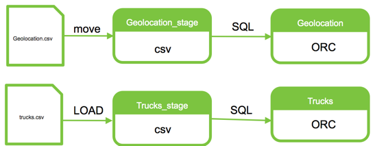

# Data Manipulation with Hive

**GOAL** - Create, populate and perform manipulations with
Hive tables

**PREREQUISITE** - [Loading Data into HDFS](../hdfs/README.md)

**SEE ALSO** - This demo is based on the publicly-available 
[Hive and Data ETL](https://hortonworks.com/tutorial/hadoop-tutorial-getting-started-with-hdp/section/3/ "Hive - Data ETL") 
Hortonworks tutorial

**RECORDED DEMO**

<a href="http://www.youtube.com/watch?feature=player_embedded&v=eOhv60m0kkc" target="_blank"></a>

**PRIOR DEMO CLEANUP** - [Cleanup](./CleanUp.md)

## Create Tables

NOTE: All testing and screen shots were done with the "original" Hive View, not the 2.0 version available in HDP 2.6 onward.

As `maria_dev` log into Ambari and navigate to the HDFS Files Ambari View to
review the previously uplodaded files in `/user/maria_dev/geolocation` that we
will be creating Hive tables for.  Then navigate to the Hive Ambari View and
explore the UI.

Show that 
[Hive's DDL Documentation](https://cwiki.apache.org/confluence/display/Hive/LanguageManual+DDL) 
should be very familiar to all _(at least, "above the line")_ and then execute 
the following table create in an empty Worksheet.

```sql
CREATE TABLE geolocation_stage 
    (truckid string, driverid string, event string, 
     latitude DOUBLE, longitude DOUBLE, city string, state string, 
     velocity BIGINT, event_ind BIGINT, idling_ind BIGINT) 
ROW FORMAT DELIMITED 
FIELDS TERMINATED BY ',' 
STORED AS TEXTFILE
TBLPROPERTIES ("skip.header.line.count"="1");
```
Then create the second staging table.

```sql
CREATE TABLE trucks_stage
    (driverid string, truckid string, model string, jun13_miles bigint, jun13_gas bigint, may13_miles bigint, may13_gas bigint, apr13_miles bigint, apr13_gas bigint, mar13_miles bigint, mar13_gas bigint, feb13_miles bigint, feb13_gas bigint, jan13_miles bigint, jan13_gas bigint, dec12_miles bigint, dec12_gas bigint, nov12_miles bigint, nov12_gas bigint, oct12_miles bigint, oct12_gas bigint, sep12_miles bigint, sep12_gas bigint, aug12_miles bigint, aug12_gas bigint, jul12_miles bigint, jul12_gas bigint, jun12_miles bigint, jun12_gas bigint,may12_miles bigint, may12_gas bigint, apr12_miles bigint, apr12_gas bigint, mar12_miles bigint, mar12_gas bigint, feb12_miles bigint, feb12_gas bigint, jan12_miles bigint, jan12_gas bigint, dec11_miles bigint, dec11_gas bigint, nov11_miles bigint, nov11_gas bigint, oct11_miles bigint, oct11_gas bigint, sep11_miles bigint, sep11_gas bigint, aug11_miles bigint, aug11_gas bigint, jul11_miles bigint, jul11_gas bigint, jun11_miles bigint, jun11_gas bigint, may11_miles bigint, may11_gas bigint, apr11_miles bigint, apr11_gas bigint, mar11_miles bigint, mar11_gas bigint, feb11_miles bigint, feb11_gas bigint, jan11_miles bigint, jan11_gas bigint, dec10_miles bigint, dec10_gas bigint, nov10_miles bigint, nov10_gas bigint, oct10_miles bigint, oct10_gas bigint, sep10_miles bigint, sep10_gas bigint, aug10_miles bigint, aug10_gas bigint, jul10_miles bigint, jul10_gas bigint, jun10_miles bigint, jun10_gas bigint, may10_miles bigint, may10_gas bigint, apr10_miles bigint, apr10_gas bigint, mar10_miles bigint, mar10_gas bigint, feb10_miles bigint, feb10_gas bigint, jan10_miles bigint, jan10_gas bigint, dec09_miles bigint, dec09_gas bigint, nov09_miles bigint, nov09_gas bigint, oct09_miles bigint, oct09_gas bigint, sep09_miles bigint, sep09_gas bigint, aug09_miles bigint, aug09_gas bigint, jul09_miles bigint, jul09_gas bigint, jun09_miles bigint, jun09_gas bigint, may09_miles bigint, may09_gas bigint, apr09_miles bigint, apr09_gas bigint, mar09_miles bigint, mar09_gas bigint, feb09_miles bigint, feb09_gas bigint, jan09_miles bigint, jan09_gas bigint)
ROW FORMAT DELIMITED
FIELDS TERMINATED BY ','
STORED AS TEXTFILE
TBLPROPERTIES ("skip.header.line.count"="1");
```

Verify both are empty by running `SELECT * FROM ...` queries and validate 
the underlying `/apps/hive/warehouse` folders were created via the HDFS
Files Ambari View.  


Show some 
other basic commands to look at Metastore's metadata after refreshing the 
Database Explorer widget.

```sql
SHOW TABLES;
DESCRIBE geolocation_stage;
SHOW CREATE TABLE geolocation_stage;
```

## Load Hive Tables

The following graphic identifies the two main approaches on the classic 
"just put the files there" strategy for _loading_ Hive tables as well 
as the "CTAS" model presented later in this section.



### Move Files

Use the HDFS Files Ambari View to _move_ `/user/maria_dev/geolocation/geolocation.csv` 
to the `/apps/hive/warehouse/geolocation_stage` directory and then verifying that
this data is now accessible via its _wrapper_ Hive table.

Leverage the _Load sample data_ smart icon (to right of table name in
Database Explorer) to create and run the following query.

```sql
SELECT * FROM geolocation_stage LIMIT 100;
```
### Load Command

The following Hive command will initial the "front door" _load_ operation.

```sql
LOAD DATA INPATH '/user/maria_dev/geolocation/trucks.csv' 
OVERWRITE INTO TABLE trucks_stage;
```
NOTE: Be sure to showcase _Content Assist_ (Control+Space to invoke) to build queries.

Verify that a ```SELECT``` query shows the results and then callout that the 
```/user/maria_dev/geolocation``` folder is empty as the ```LOAD``` command 
moved the ```trucks.csv``` file to ```/apps/hive/warehouse/trucks_stage```.

### CTAS & INSERT INTO

Another popular approach is called Create-Table-As-Select (CTAS) where we use the
results (content + metadata) to create and load a new Hive table as shown by the
following example.

```sql
CREATE TABLE geolocation STORED AS ORC AS 
    SELECT * FROM geolocation_stage;
```

After querying this new table to make sure it has the same data as 
```geolocation_stage```, execute ```DESCRIBE FORMATTED geolocation;``` and scroll
down to the bottom of the Results table to see output in the Storage Information
section.

Since the CTAS operation does perform a ```CREATE TABLE``` DDL operation, 
additional _"below the line"_ properties & clauses can be identified as needed as
shown in the next create of another ORC table.

```sql
CREATE TABLE trucks STORED AS ORC TBLPROPERTIES ("orc.compress.size"="1024") AS 
    SELECT * FROM trucks_stage;
```

NOTE: Any valid query can work embedded in an CTAS statement.

Additionally, check out [Inserting data into Hive Tables from queries](https://cwiki.apache.org/confluence/display/Hive/LanguageManual+DML#LanguageManualDML-InsertingdataintoHiveTablesfromqueries) for other options of loading tables
that are natively built into Hive.

### Other Options

There are still other ways to get data into Hive that include the following.

#### Ecosystem Frameworks & Tools

The are multiple options available when programmatically loading Hive tables.  
This includes writing applications with languages like Pig and Spark as well as 
leveraging ecosystem components such as Sqoop, Flume & Storm. 

#### CRUD Operations

Since Hive 0.14, traditional DML commands such as ```INSERT```, ```UPDATE``` and
```DELETE``` have also been available, but they aren't exact replacements for 
their counterparts in true RDBMS systems; find out more on 
[Hive's DML wiki page](https://cwiki.apache.org/confluence/x/9IKhAQ).


## Manipulate Data

Run the following CTAS statement to calculate and store truck mileage from the 
prior loaded ```trucks``` ORC-backed table into a new table called ```truck_mileage```.

```sql
CREATE TABLE truck_mileage STORED AS ORC AS 
    SELECT truckid, driverid, rdate, miles, gas, miles / gas mpg FROM trucks LATERAL VIEW stack(54, 'jun13',jun13_miles,jun13_gas,'may13',may13_miles,may13_gas,'apr13',apr13_miles,apr13_gas,'mar13',mar13_miles,mar13_gas,'feb13',feb13_miles,feb13_gas,'jan13',jan13_miles,jan13_gas,'dec12',dec12_miles,dec12_gas,'nov12',nov12_miles,nov12_gas,'oct12',oct12_miles,oct12_gas,'sep12',sep12_miles,sep12_gas,'aug12',aug12_miles,aug12_gas,'jul12',jul12_miles,jul12_gas,'jun12',jun12_miles,jun12_gas,'may12',may12_miles,may12_gas,'apr12',apr12_miles,apr12_gas,'mar12',mar12_miles,mar12_gas,'feb12',feb12_miles,feb12_gas,'jan12',jan12_miles,jan12_gas,'dec11',dec11_miles,dec11_gas,'nov11',nov11_miles,nov11_gas,'oct11',oct11_miles,oct11_gas,'sep11',sep11_miles,sep11_gas,'aug11',aug11_miles,aug11_gas,'jul11',jul11_miles,jul11_gas,'jun11',jun11_miles,jun11_gas,'may11',may11_miles,may11_gas,'apr11',apr11_miles,apr11_gas,'mar11',mar11_miles,mar11_gas,'feb11',feb11_miles,feb11_gas,'jan11',jan11_miles,jan11_gas,'dec10',dec10_miles,dec10_gas,'nov10',nov10_miles,nov10_gas,'oct10',oct10_miles,oct10_gas,'sep10',sep10_miles,sep10_gas,'aug10',aug10_miles,aug10_gas,'jul10',jul10_miles,jul10_gas,'jun10',jun10_miles,jun10_gas,'may10',may10_miles,may10_gas,'apr10',apr10_miles,apr10_gas,'mar10',mar10_miles,mar10_gas,'feb10',feb10_miles,feb10_gas,'jan10',jan10_miles,jan10_gas,'dec09',dec09_miles,dec09_gas,'nov09',nov09_miles,nov09_gas,'oct09',oct09_miles,oct09_gas,'sep09',sep09_miles,sep09_gas,'aug09',aug09_miles,aug09_gas,'jul09',jul09_miles,jul09_gas,'jun09',jun09_miles,jun09_gas,'may09',may09_miles,may09_gas,'apr09',apr09_miles,apr09_gas,'mar09',mar09_miles,mar09_gas,'feb09',feb09_miles,feb09_gas,'jan09',jan09_miles,jan09_gas ) dummyalias AS rdate, 
           miles, gas;
```

After that, run a simple ```SELECT COUNT(*)``` query and after determing that its
5400 rows is easily consumable outside of Hadoop, run a ```SELECT *``` query and use
the "Save results..." pulldown to create an Excel worksheet of the results for 
further review on your workstation.

Complete the next query demonstrating the helpfulness of the Content Assist functionality and **save it before executing it**.  NOTE: On Sandbox, this 
query may take a minute or two to complete.

```sql
SELECT truckid, avg(mpg) avgmpg 
  FROM truck_mileage 
 GROUP BY truckid;
```

After reviewing the results, indicate the multiple avenues to obtain more detailed
information for this query that can be used for advanced tuning & debugging that 
are outside the scope of this demonstration.

* Textual Explain Plan (click the Explain button and review the Results)
* Visual Explain Plan (click icon in right side nav)
* Tez Ambari View's tab for a specific DAG
  * DAG Details (including download option)
  * DAG Counters 
  * Graphical View

NOTE: This last query is a good one to show the Hive View 2.0 features such as the new _Visual Explain_ feature.

Return to the Hive Ambari View and loading the stored query and then wrapping it 
as a CTAS to stored these calculated values for faster consumption and manipulation.

```sql
CREATE TABLE avg_mileage STORED AS ORC AS
    SELECT truckid, avg(mpg) avgmpg
      FROM truck_mileage
     GROUP BY truckid;
```

Finish the tutorial up by taking at peek at the contents by leveraging the 
_Load sample data_ smart icon.