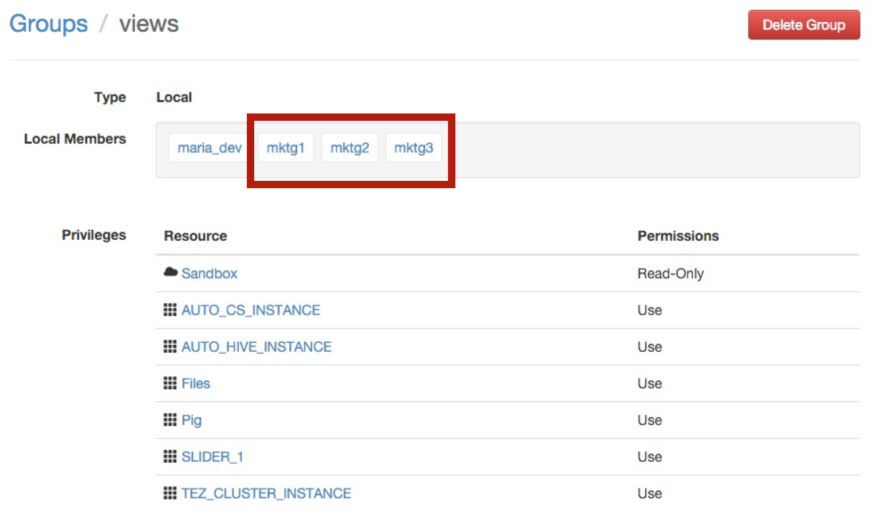

# Securing Hive with Ranger

**GOAL** - Demonstrate some cornerstone capabilities of configuring Hive access 
via Ranger

**PREREQUISITE** - [Risk Analysis with Pig](../pig/README.md)

**SEE ALSO** - This demo is based on these two publicly-available 
Hortonworks tutorials:

* [Securing your Data Lake Resource & Auditing User Access with HDP Advanced Security](http://hortonworks.com/hadoop-tutorial/securing-data-lake-auditing-user-access-using-hdp-security/ "HDP Advanced Security") 
* [Securing HDFS, Hive and HBase with Knox and Ranger](http://hortonworks.com/hadoop-tutorial/manage-security-policy-hive-hbase-knox-ranger/ "Knox and Ranger") 

**RECORDED DEMO**

## Use Cases

The Sandbox is provisioned with a user group called `Marketing` which is made up
of the following individual user accounts; `mktg1`, `mktg2` and `mktg3`. The 
following **_"prevent `Marketing` users from access to view ..."_** restrictive
use cases will be explored in this demo.

Type | Specifics
--- | ---
Table|`geolocation_stage` and `trucks_stage`
Row|Where `geolocation.event` is not equal to `normal`
Column|`events` and `totmiles` from `risk_factor` 

## Environment Preparation

### Allow for Marketing Users to Log into Ambari

The `Marketing` users are already created on the underlying Linux system, but
they need to be allowed to log into Ambari so they can use the Hive View. 
Log into Ambari as `admin` and go to the _admin_ pulldown in upper-right corner,
select _Manage Ambari_ > _Users_ > _Create Local User_ and then create accounts
for `mktg1`, `mktg2` and `mktg3` (set password to `password` for all three) 
which should look like the following.

After creating the third user, click on the _Groups_ link in the left-side 
_User + Group Management_ UI widget to view the list of groups.  Click on the
_views_ group which will expose a _Local Members_ box where you can add the
three `Marketing~ users to and should look like the following.

### Disable Hive Global Access

As identified in the Sandbox splash page, open a browser on the Ranger UI at
<http://127.0.0.1:6080> and login with `admin` / `admin` credentials.  Select
the _Sandbox_hive_ link and then click on _Policy ID_ link associated with 
the "Hive Global Tables Allow" policy from the list.

Move the _Policy Name_'s `enabled` slider selection to `disabled` and click
on the _Save_ button at the bottom.

### Verify Preparation

At this point, the `Marketing` user should not be able see any tables.  Log
into Ambari as `mktg1` and within the Hive View validate no tables are listed
under the `default` _Databases_ table list as well as `show tables;` returns
an empty list.  Additionally, a security error should be display when 
attempting to run a query.

## Table-Level Restriction

Since we are starting with zero access to `Marketing`, we will create a 
single security policy to allow the team to view all tables except the 
staging ones.  Log into Ranger as `admin` and navigate to _Sandbox_hive_
and then click _Add New Policy_ to create a policy named "Default Mktg
Access to Trucking" that is configured to allow access to all tables in
the `default` database except for the "staging" tables.

Now, back in Ambari's Hive View, the `mktg1` user can retrieve results 
for `show tables;` as well as see the list of tables in the _Databases_ UI
widget.  More importantly, this you can now run queries on the tables 
shown in the list (ex: `SELECT * FROM driver_mileage LIMIT 100;`).

To validate the table-level restriction is in place, attempt to run a query
on one of the staging tables to verify a security error is presented.

## Row-Level Restriction

## Column-Level Restriction

## Environment Reset

