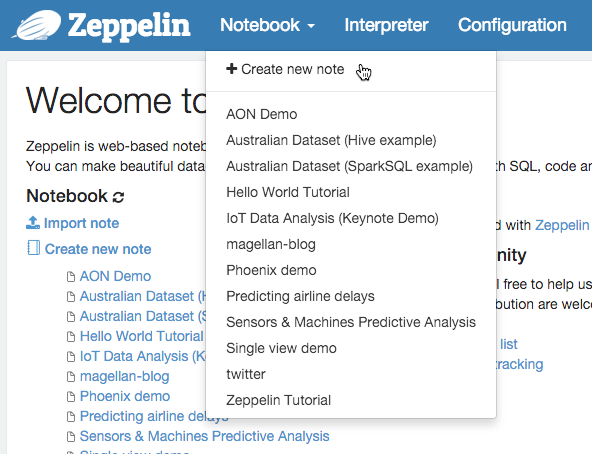
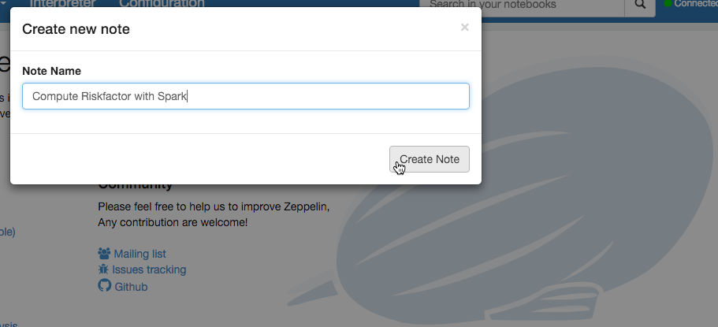
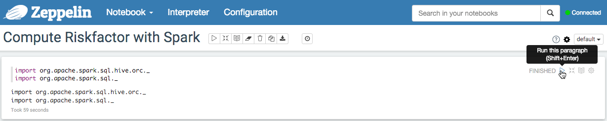
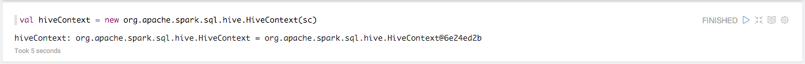
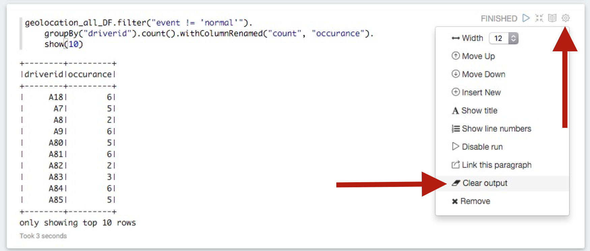
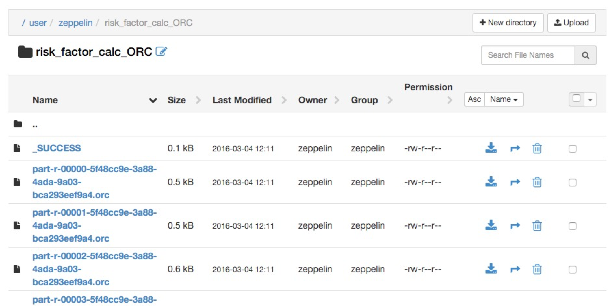
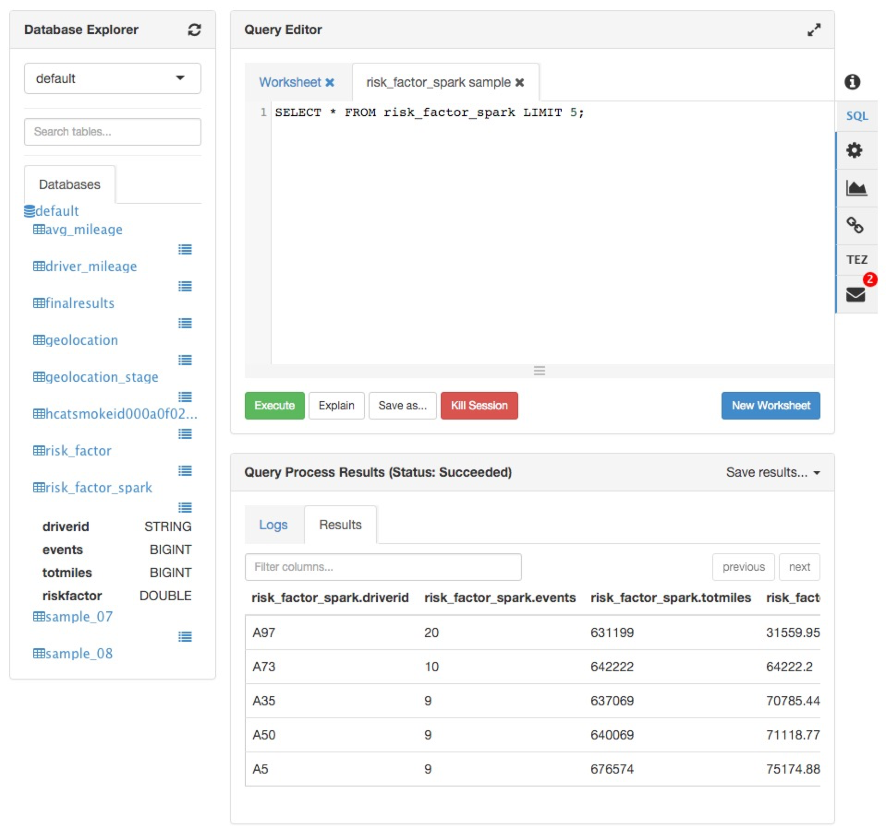
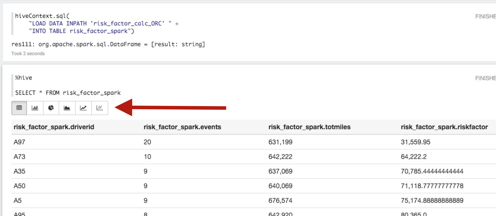
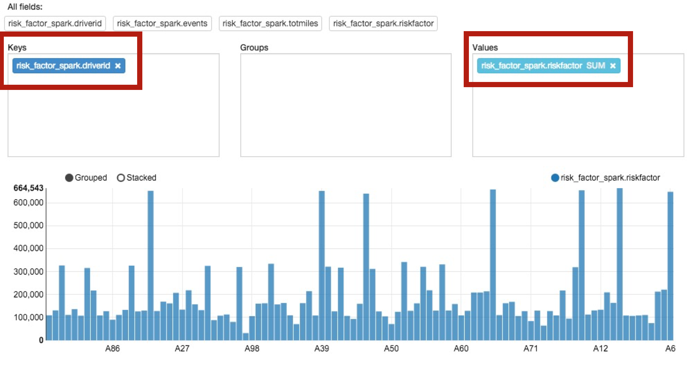
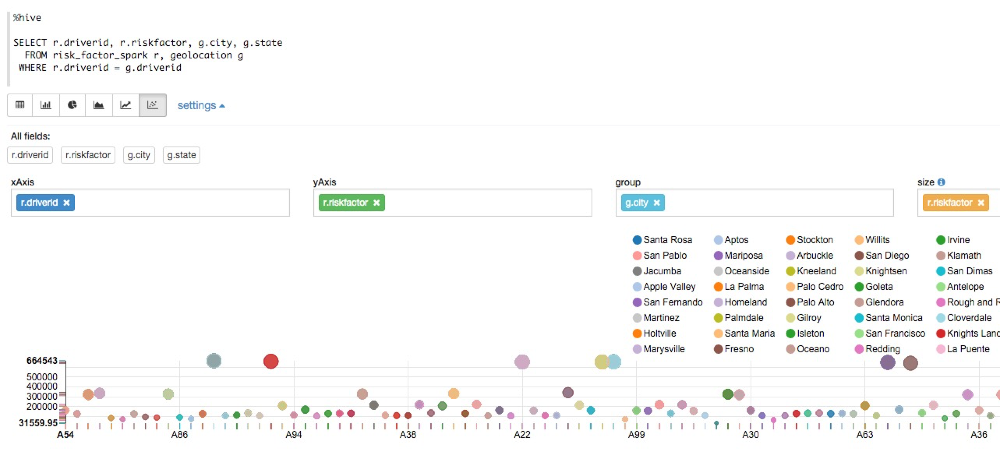

# Risk Analysis with Spark

**GOAL** - Calculate risk factors for drivers with Spark and utilize
Zeppelin to visualize the results _-- this demo will produce the same 
results as [Risk Analysis with Pig](../pig/README.md)_

**PREREQUISITE** - [Risk Analysis with Pig](../pig/README.md)

**SEE ALSO** - This demo is based on these two publicly-available 
Hortonworks tutorials:

* [Spark Risk Factor Analysis](https://hortonworks.com/tutorial/hadoop-tutorial-getting-started-with-hdp/section/5/ "Spark - Risk Factor") 
* [Data Visualization using Apache Zeppelin](https://hortonworks.com/tutorial/hadoop-tutorial-getting-started-with-hdp/section/6/ "Data Reporting with Zeppelin") 

**RECORDED DEMO**

<a href="http://www.youtube.com/watch?feature=player_embedded&v=Z0sPzJEAZZ8" target="_blank"></a>

**PRIOR DEMO CLEANUP** - [Cleanup](./CleanUp.md)

## Prepare Coding Environment

As directed from the Sandbox _Splash Page_, open Zeppelin by navigating your 
browser to <http://127.0.0.1:9995>.  Once there, Click on _Notebook_ > 
_Create new note_ and name it "Compute Riskfactor with Spark".





Get started with adding these Scala imports to your Zeppeline notebook and 
then clicking the play button (or press Shift+Enter) to run the code.

```scala
import org.apache.spark.sql.hive.orc._
import org.apache.spark.sql._
```



Instantiate HiveContext by adding the next line of code in the next code
block window and run this code.

```scala
val hiveContext = new org.apache.spark.sql.hive.HiveContext(sc)
```



NOTE: Continue with this pattern of putting subsequent code in following
code block windows (aka paragraphs) to avoid having to rerun any prior 
coding snippets.

## Load DataFrame Objects

View the list of table available from Hive.  

```scala
hiveContext.sql("show tables").collect.foreach(println)
```

Load the contents of the `geolocation` Hive table into a
DataFrame for use within Spark.

```scala
val geolocation_all_DF = hiveContext.sql("SELECT * FROM geolocation")
```

Display its results.

```scala
geolocation_all_DF.show(10) 
```

Register this DataFrame so it can be used within SQL statements.

```scala
geolocation_all_DF.createTempView("geolocation_all_temp")
```

## Transform/Process Data

Filter out the drivers who only have "normal" driving events and 
calculate the count of risky events for each remaining driver.
Then register this new DataFrame to allow subsequent SQL operations.

```scala
val risky_driver_event_counts_DF = hiveContext.sql(
    "SELECT driverid, count(driverid) occurance " +
    "  FROM geolocation_all_temp " +
    " WHERE event != 'normal' " +
    " GROUP BY driverid ")
risky_driver_event_counts_DF.createTempView("risky_driver_event_counts_temp")
```

Review these results.

```scala
risky_driver_event_counts_DF.show(10)
```

NOTE: You can do this from the DataFrame API as well instead as a query.

```scala
geolocation_all_DF.filter("event != 'normal'").
    groupBy("driverid").count().withColumnRenamed("count", "occurance").
    show(10)
```

NOTE: To conserve resources in the notebook, use the "Clear Output" functionality
that is available by clicking on the gear icon in upper-right corner of this
paragraph and then selecting "Clear Output" as shown in the following screenshot.



Now, join the temporary table that holds the risky drivers and their
counts with Hive's `driver_mileage` table created in 
[Risk Analysis with Pig](../pig/README.md), then store that DataFrame
as a temporary table.

```scala
val joined_DF = hiveContext.sql(
    "SELECT rd.driverid, rd.occurance, dm.totmiles " + 
    "  FROM risky_driver_event_counts_temp rd, driver_mileage dm " +
    " WHERE rd.driverid = dm.driverid")
joined_DF.createTempView("joined_temp")
```
Review the results of the join.

```scala
joined_DF.show(10)
```

Again, you can alternatively do this with the DataFrame API.  Notice
that we did have to get the `driver_mileage` table into a DataFrame.

```scala
val driver_mileage_DF = hiveContext.sql("SELECT * FROM driver_mileage")

risky_driver_event_counts_DF.join(
    driver_mileage_DF, 
    risky_driver_event_counts_DF("driverid") === driver_mileage_DF("driverid"), 
    "inner").drop(driver_mileage_DF.col("driverid")).
    show(10) 
```

NOTE: As before, use the "Clear Output" functionality on this unwanted paragraph.

## Calculate Risk

Create a new DataFrame than contains, by driver, the risk calculation of 
total miles driven divided by the number of risky events.  Register this 
as a temporary table and dump the contents to the notebook.

```scala
val risk_factor_calc_DF = hiveContext.sql(
    "SELECT driverid, occurance, totmiles, totmiles/occurance riskfactor " +
    "  FROM joined_temp")
risk_factor_calc_DF.createTempView("risk_factor_calc_DF")
risk_factor_calc_DF.show(20)
```

Create a new table similar to the `risk_factor` one created in
[Risk Analysis with Pig](../pig/README.md) to saved the newly 
calculated risk values from Spark.

```scala
hiveContext.sql(
    "CREATE TABLE risk_factor_spark( " +
    "   driverid String, events bigint, totmiles bigint,riskfactor double) " +
    "STORED AS ORC")
```

Verify from the Hive View (logged in as `admin` is fine) this table has been 
created and is empty.

Since we created this table to be backed by the ORC file format, we need
to persist `risk_factor_calc_DF` to disk in that format.

```scala
risk_factor_calc_DF.write.format("orc").save("risk_factor_calc_ORC")
```

Verify from the HDFS Files View that this information was persisted.



Load the data into Hive.

```scala
hiveContext.sql(
    "LOAD DATA INPATH 'risk_factor_calc_ORC' " +
    "INTO TABLE risk_factor_spark")
```

Verify it made by querying from Hive View.



## Visualize Data

In a fresh paragraph, add the following query and execute it.

```sql
%sql

SELECT * FROM risk_factor_spark
```

Explore the various charts that are available from the toolbar highlighted below.



Choose the _Bar Chart_ icon, click on _settings_ next to the toolbar, and then set `driverid` in the 
_Keys_ field and `riskfactor` in the _Values_ field to see the peaks and 
valleys of ranges amongst drivers.



NOTE: As before, click on "Clear output" to free up visual space and system resources.  Additionally (especially on prior versions of the Sandbox), it may become necessary to
use Ambari to stop and start services.  Ideally, shutdown Zeppellin and 
then Spark and start them up in reverse order.

Run another query to visualize against after creating a new notebook.

```sql
%sql

SELECT r.driverid, r.riskfactor, g.city, g.state 
  FROM risk_factor_spark r, geolocation g 
 WHERE r.driverid = g.driverid
```

This time pick the right-most icon in the toolbar select:

* `driverid` for _xAxis_
* `riskfactor` for _yAxis_
* `city` for _group_
* `riskfactor` for _size_



This is just a quick intro to the types of visualization opportunities 
that exist with Zeppelin.