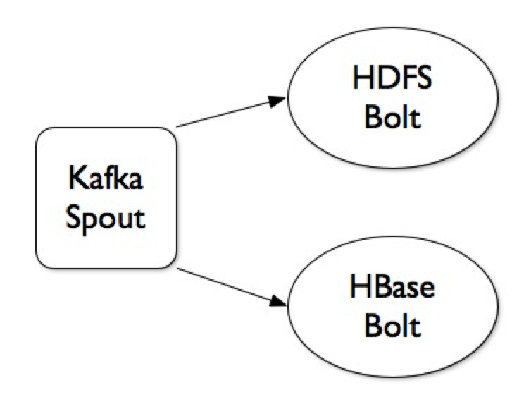

# Streaming Data into HDFS

---

_**NOTE:**_ This lab has **NOT** been tested since the [HDP 2.4 version of this course](https://github.com/HortonworksUniversity/Essentials/tree/Sandbox-2.4 "Ess for HDP 2.4") and is being deprecated from the Essentials demo list. 

---

**GOAL** - Load sample trucking data into HDFS and HBase via a real-time
data streaming workflows

**PREREQUISITE** - [Sandbox Setup](../SandboxSetup.md)

**SEE ALSO** - This demo is based on the publicly-available 
[Real Time Data Transportation and Ingestion](http://hortonworks.com/hadoop-tutorial/simulating-transporting-realtime-events-stream-apache-kafka/ "Tutorial: Real Time Data Transportation and Ingestion") 
Hortonworks tutorial

**RECORDED DEMO**

<a href="http://www.youtube.com/watch?feature=player_embedded&v=Bp96x70HpEM" target="_blank"></a>

**PRIOR DEMO CLEANUP** - [Cleanup](./CleanUp.md)

## Generating Events into Kafka

The first part of this demo focuses on producing trucking events into a 
Kafka topic with the following format and example data.

Event Time | Driver ID | Truck ID | Event Type | Longitude | Latitude
--- | --- | --- | --- | --- | ---
2016-02-26 02:14:27.311|4|14|Normal|-73.994914000000108|40.666580999999951
2016-02-26 02:14:28.315|1|11|Unsafe tail distance|-79.74708499999997|42.129558000000088
2016-02-26 02:14:29.319|2|12|Normal|-74.02332|41.50084

After using Ambari to verify the Kafka service is running (and start if
necessary), create/verify a new Topic.

```
[root@sandbox ~]# cd /usr/hdp/current/kafka-broker/bin/
[root@sandbox bin]# ./kafka-topics.sh --create --zookeeper localhost:2181 --replication-factor 1 --partitions 1 --topic truckevent
[root@sandbox bin]# ./kafka-topics.sh --list --zookeeper localhost:2181
```

NOTE: You can delete this topic with `/usr/hdp/current/kafka-broker/bin/kafka-topics.sh --zookeeper localhost:2181 --delete --topic truckevent` 
**AFTER** you switch the `delete.topic.enable` value to `true` found in Ambari under _Services_ > _Kafka_ > _Configs_ > _Advanced kafka-broker_.

NOTE: The following instructions about downloading, editing & building
the source are presented to ensure the demo is reproducible, but these
steps should be done beforehand when an instructor is presenting this demo.

Then download the event generator code.

```
[root@sandbox ~]# mkdir /opt/TruckEvents   
[root@sandbox ~]# cd /opt/TruckEvents   
[root@sandbox TruckEvents]# wget https://www.dropbox.com/s/rv43a05czfaqjlj/Tutorials-master-2.3.zip  
[root@sandbox TruckEvents]# unzip Tutorials-master-2.3.zip
```

Make a copy of the `pom.xml` file and to account for a missing dependency. 

```
[root@sandbox TruckEvents]# cd Tutorials-master
[root@sandbox Tutorials-master]# cp pom.xml pom.xml.backup
```

Add the following stanza to ```pom.xml```.

```xml
        <dependency>
            <groupId>com.googlecode.json-simple</groupId>
            <artifactId>json-simple</artifactId>
            <version>1.1.1</version>
        </dependency>
```

Install Maven.

```
[root@sandbox Tutorials-master]# curl -o /etc/yum.repos.d/epel-apache-maven.repo https://repos.fedorapeople.org/repos/dchen/apache-maven/epel-apache-maven.repo
[root@sandbox Tutorials-master]# yum -y install apache-maven
[root@sandbox Tutorials-master]# mvn -version
```

Then rebuild the artifacts (this will take several minutes).

```
[root@sandbox Tutorials-master]# mvn clean install
[root@sandbox Tutorials-master]# mvn clean package
```

To start the Kafka Producer, execute the following command.

```
[root@sandbox Tutorials-master]# java -cp target/Tutorial-1.0-SNAPSHOT.jar com.hortonworks.tutorials.tutorial1.TruckEventsProducer sandbox.hortonworks.com:6667 sandbox.hortonworks.com:2181
```

After a few seconds, press Control-C to stop the producer.

We have now successfully compiled the Kafka producer and had it publish some messages to the Kafka cluster.  To verify, execute the following command to start a consumer to see the produced events.

```
[root@sandbox Tutorials-master]# /usr/hdp/current/kafka-broker/bin/kafka-console-consumer.sh --zookeeper sandbox.hortonworks.com:2181 --topic truckevent --from-beginning
```

You can press Control-C to stop the console consumer.

## Process Events with Storm

For this demo, we have a simple Storm topology made up of the following 
components (and visualized below).

* **Kafka Spout** - Retrieves events from the Kafka topic and raises them as Tuples into a Stream
* **HDFS Bolt** - Receives the Tuples from the spout and persists the information to HDFS files
* **HBase Bolt** - Receives the Tuples from the spout and inserts the data into HBase tables
  * All events go into the `truck_events` table
  * Only those events that represent an "incident" are accounted for in `driver_dangerous_events`



Via Ambari, ensure HBase is running and then create the two previously
described tables

```
[root@sandbox Tutorials-master]# hbase shell
hbase(main):001:0> create 'truck_events', 'events'
hbase(main):001:0> create 'driver_dangerous_events', 'count'
hbase(main):001:0> list
```

Via Ambari, ensure Storm is running and then deploy the topology.

```
[root@sandbox Tutorials-master]# storm jar target/Tutorial-1.0-SNAPSHOT.jar com.hortonworks.tutorials.tutorial3.TruckEventProcessingTopology  
```

Restart the Kafka event generator.

```
[root@sandbox Tutorials-master]# java -cp target/Tutorial-1.0-SNAPSHOT.jar com.hortonworks.tutorials.tutorial1.TruckEventsProducer sandbox.hortonworks.com:6667 sandbox.hortonworks.com:2181
```

Verify that the topology is being monitored via the
[Storm UI](http://127.0.0.1:8744/ "Storm UI").  Drill into the topology itself
as well as the spout and bolts to see counts.  NOTE: It will likely take 
several minutes before the topology begins to show "emit" counts, so please 
be patient.  Also, while in the Storm UI be sure to also review the 
Visualization Tool output which uses visual metaphors such as:

* Blue circles for spouts
* Green _(to Red)_ circles for bolts
* Sizes of circles are in relation to how the performance compares with other components of the topology
* Width of line is relative to how much data is being delivered for each stream

Via the Ambari HDFS View, verify data is being populated in `/truck-events-v4`.

Via the HBase shell, verify rows are being added to the tables.

```
[root@sandbox Tutorials-master]# hbase shell
hbase(main):001:0> count 'truck_events'
hbase(main):001:0> count 'driver_dangerous_events'
```

_To stop everything, hit Control-C in the Kafka producer window and "kill" the topology from the Storm UI._